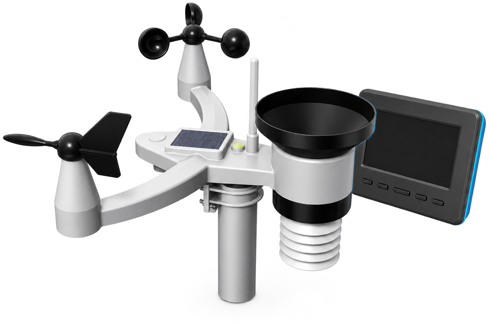

# FT0360 Wetterstation – lokale Home-Assistant-Integration für LANDI & OEM



Diese Custom Component liest die LANDI/FT0360 WiFi-Wetterstation vollständig lokal aus.
Es werden keine Cloud-Dienste, Konten oder API-Schlüssel benötigt.

## Modell und OEM-Hinweis

**LANDI** vertreibt die Wetterstation in der Schweiz unter eigener Handelsmarke. Die
WLAN-Konsole identifiziert sich technisch als **FT0360** auf einer ESP8266-basierten
Plattform und ist auch international als OEM-Gerät beziehungsweise unter anderen
Handelsmarken erhältlich. Diese Integration richtet sich deshalb nach dem lokalen
FT0360-Protokoll, nicht nach einem LANDI-Cloud-Dienst: Sie kann auch mit baugleichen
OEM-Modellen funktionieren, sofern deren lokale Endpunkte kompatibel sind.

Verwendete Endpunkte:

```text
http://<IP>/client?command=record
http://<IP>/client?command=about
http://<IP>/config?command=connect_status
http://<IP>/config?command=Firmware
http://<IP>/config?command=debug
```

`record` ist die einzige Quelle sämtlicher Wetterwerte. `about` und `Firmware` liefern
statische Geräteinformationen, `connect_status` die Netzwerkdiagnose. Der undokumentierte
`debug`-Endpunkt wird ausschliesslich dann abgerufen, wenn in Home Assistant ein
Diagnosebericht heruntergeladen wird; er gehört nicht zum regulären Polling.

## Funktionen

- Einrichtung über die Home-Assistant-Oberfläche per IP-Adresse oder Hostname
- Frei wählbarer Messbereich: alle Werte, nur Innen oder nur Aussen
- Gemeinsames, einstellbares Polling aller Werte (5–300 Sekunden, Standard 10)
- Stabile Geräte-/Entitätsidentitäten anhand der MAC-Adresse und lesbare Entity-IDs
- Home-Assistant `DeviceInfo` mit Hersteller, Modell, Firmware-Build und Konfigurations-URL
- Passende Einheiten, Device Classes und State Classes für Langzeitstatistiken
- Robuster Parser mit Feldnamen- und Positions-Fallback
- Tolerant gegenüber fehlerhaft dargestellten Einheiten wie `°C`, `°` oder `w/m²`
- Batterieproblem als Binary Sensor; Originalmeldung bleibt als Attribut erhalten
- Diagnose-Sensoren für Verbindungsstatus, interne WLAN-Signalstufe, IP, Gateway,
  Firmware-Version und Firmware-Build
- Deutsche und englische Übersetzungen
- Diagnose-Download mit optionalen Debug-Daten und ausgeblendeter IP-/MAC-Adresse
- Keine zusätzlichen Python-Abhängigkeiten

## Sensoren

| Entity-ID-Vorschlag | Messwert | Einheit |
|---|---|---:|
| `sensor.ft0360_indoor_temperature` | Innentemperatur | °C |
| `sensor.ft0360_indoor_humidity` | Innenluftfeuchtigkeit | % |
| `sensor.ft0360_outdoor_temperature` | Aussentemperatur | °C |
| `sensor.ft0360_outdoor_humidity` | Aussenluftfeuchtigkeit | % |
| `sensor.ft0360_pressure_absolute` | Absoluter Luftdruck | hPa |
| `sensor.ft0360_pressure_relative` | Relativer Luftdruck | hPa |
| `sensor.ft0360_max_daily_gust` | Maximale Tagesböe | m/s |
| `sensor.ft0360_wind_speed` | Windgeschwindigkeit | m/s |
| `sensor.ft0360_wind_gust` | Windböe | m/s |
| `sensor.ft0360_wind_direction` | Windrichtung | ° |
| `sensor.ft0360_wind_direction_cardinal` | Himmelsrichtung | N, NO, O … |
| `sensor.ft0360_wind_average_2_minute` | Windmittel 2 Minuten | m/s |
| `sensor.ft0360_wind_direction_average_2_minute` | Richtungsmittel 2 Minuten | ° |
| `sensor.ft0360_wind_average_10_minute` | Windmittel 10 Minuten | m/s |
| `sensor.ft0360_wind_direction_average_10_minute` | Richtungsmittel 10 Minuten | ° |
| `sensor.ft0360_rain_rate` | Regenrate | mm/h |
| `sensor.ft0360_rain_hour` | Regen diese Stunde | mm |
| `sensor.ft0360_rain_day` | Regen heute | mm |
| `sensor.ft0360_rain_week` | Regen diese Woche | mm |
| `sensor.ft0360_rain_month` | Regen diesen Monat | mm |
| `sensor.ft0360_rain_year` | Regen dieses Jahr | mm |
| `sensor.ft0360_rain_total` | Regen gesamt | mm |
| `sensor.ft0360_solar_radiation` | Solarstrahlung | W/m² |
| `sensor.ft0360_uv_index` | UV-Index | – |
| `sensor.ft0360_connection_status` | WLAN-Verbindungsstatus | – |
| `sensor.ft0360_wifi_signal_level` | Interne WLAN-Signalstufe | 1–3 typ. |
| `sensor.ft0360_ip_address` | IP-Adresse der Konsole | – |
| `sensor.ft0360_gateway` | Standard-Gateway | – |
| `sensor.ft0360_firmware_version` | Firmware-Version | – |
| `sensor.ft0360_firmware_build` | Firmware-Build | – |
| `binary_sensor.ft0360_battery_low` | Mindestens eine Batterie schwach | Ein/Aus |

Home Assistant kann eine vorgeschlagene Entity-ID bei Namenskonflikten oder durch eigene
Entity-ID-Einstellungen (zum Beispiel mit Bereichsnamen) ergänzen. Bereits angelegte
Entity-IDs werden bei Updates nicht verändert.

## Voraussetzungen

- Home Assistant 2026.6 oder neuer
- Wetterstation und Home Assistant im selben erreichbaren lokalen Netzwerk
- Feste DHCP-Zuweisung für die Wetterstation empfohlen

Der Außensensor überträgt laut Gerätehandbuch alle 16 Sekunden. Der Standard von 10 Sekunden
priorisiert eine kurze Verzögerung, kann aber denselben Messwert zweimal lesen. Wer weniger
Anfragen an die Konsole senden möchte, kann das Intervall auf 20 oder 30 Sekunden erhöhen.

Die angezeigte WLAN-Signalstufe stammt unverändert aus `rssi` des Geräts. Sie ist eine
interne Stufe und ausdrücklich **kein dBm-Wert**; deshalb verwendet die Entität keine
irreführende Signalstärke-Device-Class.

Die Batterie-Warnung des Außensensors wird laut Handbuch unter 3,6 V ausgelöst. Die lokale
Schnittstelle liefert dafür keinen Spannungswert, sondern nur eine Statusmeldung; diese wird
als Batterie-Binary-Sensor abgebildet.

Vor der Installation kann der Endpunkt im Browser geprüft werden:

```text
http://192.168.1.236/client?command=record
```

Die Antwort muss ein JSON-Objekt mit einer `Sensor`-Liste enthalten.

## Installation mit HACS

Solange das Projekt nicht im HACS-Standardkatalog veröffentlicht ist:

1. Diesen Ordner in ein eigenes GitHub-Repository übertragen.
2. In HACS **Integrationen** öffnen.
3. Über das Menü **Benutzerdefinierte Repositories** wählen.
4. Die URL des Repositorys eintragen und als Kategorie **Integration** auswählen.
5. `LANDI FT0360 Weather Station` herunterladen.
6. Home Assistant neu starten.

Die Metadaten in `custom_components/ft0360/manifest.json` verweisen auf dieses Repository.

## Manuelle Installation

Den Ordner

```text
custom_components/ft0360
```

nach

```text
<Home-Assistant-Konfiguration>/custom_components/ft0360
```

kopieren und Home Assistant neu starten. Die Verzeichnisstruktur muss danach so aussehen:

```text
config/
└── custom_components/
    └── ft0360/
        ├── __init__.py
        ├── manifest.json
        ├── config_flow.py
        └── ...
```

## Einrichtung

1. **Einstellungen → Geräte & Dienste → Integration hinzufügen** öffnen.
2. Nach **LANDI FT0360** suchen.
3. IP-Adresse oder Hostname eintragen, beispielsweise `192.168.1.236`.
4. Den Messbereich wählen: **Innen & Aussen**, **nur Innen** oder **nur Aussen**.
5. Das Abfrageintervall wählen; voreingestellt sind 10 Sekunden.

Die Integration prüft bei der Einrichtung sowohl `record` als auch `about`. Für dieselbe
Station kannst du je eine Einrichtung mit **nur Innen** und **nur Aussen** anlegen. Damit
entstehen zwei getrennte Home-Assistant-Geräte; das Innengerät kannst du danach einem Raum
zuordnen. Die Innen-Einrichtung zeigt ausschliesslich Temperatur und Luftfeuchtigkeit. Die
Aussen-Einrichtung enthält die übrigen Wetterwerte sowie Batterie- und Netzwerkdiagnosen.
Eine zweite Einrichtung mit demselben Messbereich wird weiterhin anhand der MAC-Adresse
verhindert. Firmware- und
Verbindungsdaten sind optionale Diagnose-Endpunkte: Falls eine andere Firmware sie nicht
bereitstellt, bleiben die Wetterwerte funktionsfähig und nur die betroffenen Diagnosewerte
werden nicht verfügbar.

Der versteckte `debug`-Endpunkt ist noch loser gekoppelt: Er wird weder beim Einrichten noch
beim normalen Aktualisieren aufgerufen. Erst beim manuellen Diagnose-Download liest die
Integration daraus die interne Plattformbezeichnung, den Firmwaretext, die lokale
Gerätezeit, Uploadstatus, `synctime`, `time_info`, das Feature-Flag und die `Option`-Werte.
Unklare Felder wie `synctime` werden absichtlich nicht interpretiert. Die lokale Gerätezeit
wird wegen der fehlenden eindeutigen Zeitzonenangabe nicht als Zeitstempel-Sensor angelegt.

Adresse und Intervall lassen sich später über **Konfigurieren** ändern. Beim Ändern der
Adresse wird geprüft, dass dort weiterhin dieselbe Station erreichbar ist.

## Fehlerbehebung

- **Verbindung fehlgeschlagen:** IP-Adresse, feste DHCP-Zuweisung, VLAN-/Firewall-Regeln
  und Erreichbarkeit aus dem Home-Assistant-Netz prüfen.
- **Ungültige Antwort:** Die beiden Kern-Endpunkte `record` und `about` im Browser öffnen
  und kontrollieren, ob JSON
  zurückkommt. Eine HTML-Loginseite oder ein Proxy vor der Station wird nicht unterstützt.
- **Einzelner Sensor nicht verfügbar:** Die Konsole liefert für diesen Wert möglicherweise
  `--` oder keinen Zahlenwert. Andere Sensoren bleiben verfügbar.
- **Alle Sensoren nicht verfügbar:** Nach einem Timeout markiert Home Assistant die
  Coordinator-Entities als nicht verfügbar und versucht es beim nächsten Intervall erneut.
- **Diagnosen:** Unter **Geräte & Dienste → LANDI FT0360 → Drei-Punkte-Menü → Diagnose
  herunterladen**. Host und MAC-Adresse werden ausgeblendet.

## Entwicklung und Tests

Der Parser ist unabhängig von Home Assistant testbar:

```bash
python3 -m unittest discover -s tests -v
```

Die Tests decken das echte FT0360-Format, Mojibake-Einheiten, vertauschte Felder,
Positions-Fallback, fehlende Zahlenwerte, Batterieauswertung, Windrichtungen sowie
Firmware-, Verbindungs- und Debug-Antworten ab.

## Datenschutz

Die Integration kommuniziert nur per HTTP mit der eingetragenen lokalen Adresse. Sie sendet
keine Wetterdaten nach aussen und verwendet keine Cloud-Schnittstelle. Implementiert sind
ausschliesslich lesende `GET`-Abfragen. Auch der Debug-Endpunkt wird nur mit `GET` gelesen.
Die bekannten schreibenden Funktionen für WLAN- und Serverkonfiguration, Kalibrierung,
Sensorregistrierung, AP-Modus und Firmware-Updates werden bewusst nicht verwendet.

## Inspiration und Unterschiede

Ausgangspunkt und Inspiration war die MIT-lizenzierte Integration
[DeadMonkey428/ha_ft0360](https://github.com/DeadMonkey428/ha_ft0360). Sie liefert die
grundlegende Zuordnung der von der Konsole ausgegebenen Sensorgruppen und ist bereits als
HACS-Repository veröffentlicht.

Diese Fassung ergänzt insbesondere einen semantischen Parser mit Positions-Fallback,
Mojibake-Toleranz, getrennte Verbindungs-/Formatfehler, Einzelwert-Verfügbarkeit,
Parser-Tests und die Home-Assistant-Config-Flow-API ab 2026.6 ohne doppelte Reloads.

## Lizenz

MIT
